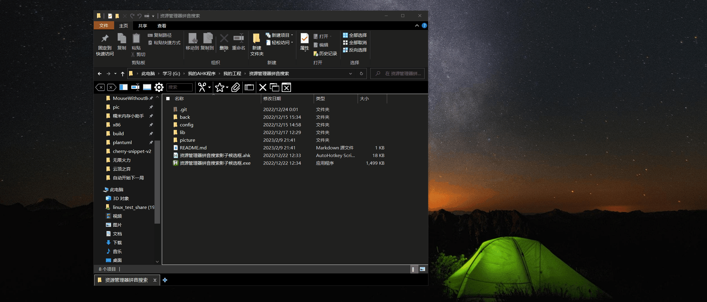

# 资源管理器拼音搜索扩展

[github](https://github.com/sxzxs/explore_select_items)
## 介绍

类似tc资源管理器的拼音插件, 通过拼音来过滤内容
不仅支持**拼音首字母**，还支持**全屏、双拼、86五笔等**

## 使用效果

## 使用说明
1. 下载 [github下载](https://github.com/sxzxs/explore_select_items/archive/refs/heads/master.zip)
2. 右键管理员执行exe程序,如果安装ahkv1,可以直接执行ahk脚本
3. 在windows资源管理器使用

## todo
* 右键菜单状态屏蔽功能
* 挂载盘路径可能识别不了